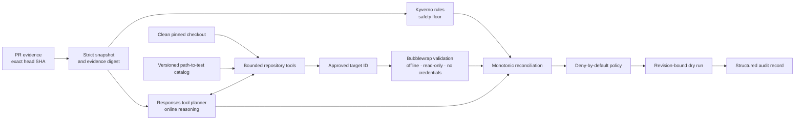

# Kyverno Maintainer Assistant

> The model investigates. Deterministic policy authorizes.

A guarded, dry-run vertical slice for the CNCF Kyverno AI Assistant mentorship project. It is
grounded in the official [LFX project listing](https://github.com/cncf/mentoring/blob/main/programs/lfx-mentorship/2026/03-Sep-Nov/README.md#ai-assistant)
and [Kyverno issue #16665](https://github.com/kyverno/kyverno/issues/16665).

This is an independent applicant prototype, not an official Kyverno component or a completed
implementation of the mentorship roadmap.

## The problem

Reviewing a change is more than reading its diff. A maintainer must rebuild context: which Kyverno
subsystems are affected, which generated artifacts and tests matter, whether existing checks belong
to the latest commit, and what remains uncertain. That work repeats across dependency updates,
stale branches, issue reports, and support questions.

The goal is to turn scattered evidence into the next safe action without replacing maintainer toil
with noisy or over-privileged automation.

## Approach

The prototype separates evidence, reasoning, execution, and authority:

1. bind evidence to one exact pull-request commit;
2. apply versioned Kyverno-specific rules as a minimum safety floor;
3. let a Responses tool planner inspect only a pinned checkout through bounded tools;
4. map changed paths to reviewed validation target IDs—not model-authored shell;
5. execute the fixed target in an offline, read-only Bubblewrap sandbox;
6. reconcile model judgment with rules so risk and required checks cannot be lowered;
7. apply deny-by-default capability policy and emit an auditable dry run.

## Architecture



The model API call is online through the official OpenAI Python SDK and Responses interface. The
Kyverno test process is separately forced offline. The Python host owns tools, commands,
credentials, policy, budgets, and audit.

## Working vertical slice

- strict, redacted, revision-bound PR evidence;
- versioned Kyverno rules and path-to-validation catalog;
- repository tree, literal search, bounded read, target lookup, and target execution tools;
- one executable CEL compiler target resolved to `go test ./pkg/cel/compiler`;
- offline network namespace, read-only source/module cache, fresh build cache, dropped capabilities,
  and execution limits;
- monotonic rule/model reconciliation, closed capabilities, kill switch, idempotency, and audit;
- rules-only, model-only, and hybrid comparison across ten applicant-annotated cases;
- 68 automated tests covering schemas, tools, sandboxing, policy, audit binding, and end-to-end flows.

### Real PR evidence

The main case is Kyverno PR
[#17067](https://github.com/kyverno/kyverno/pull/17067), a two-file `cel-go` dependency update at
commit `c5ee06b1c6a3ea99723cd4e9a41648ec6a6c4ee1`.

```text
validation: unit.cel.compiler outcome=passed exit=0 network=unshared
decision: escalate risk=high
required: dependency.review, unit.all, human.dependency-review
```

The scoped test passes, but that evidence does not authorize merge. Dependency review, the full
unit gate, and human judgment remain required.

## Safety properties

| Risk | Enforced boundary |
|---|---|
| Stale or mismatched evidence | Exact head SHA and content digests |
| Malicious repository text | Strict schemas, redaction, and untrusted-data framing |
| Arbitrary command execution | Closed target IDs resolved to fixed host-owned argv |
| Secret or network access during tests | Cleared environment and unshared network namespace |
| Repository mutation | Read-only checkout and module cache |
| Model lowers required checks or risk | Monotonic reconciliation with deterministic rules |
| Model proposes forbidden authority | Closed capability vocabulary and deny-by-default policy |
| Duplicate or changed authorization | Full decision binding, expiry, kill switch, and idempotency |

The synthetic hostile case deliberately proposes `read_secret` and `merge`; both are unavailable as
tools and denied by policy. Existing CI, reviews, code ownership, and branch protection remain
authoritative.

## Evaluation

```text
VARIANT      RECALL  UNSAFE-PROP  UNSAFE-AUTH  FALSE-REASSURE  ESC-CORRECT
rules_only   1.0     0            0            1               10/10
model_only   0.9231  2            0            1               8/10
hybrid       1.0     0            0            0               10/10
```

These ten cases are architecture checks, not a production benchmark or maintainer-approved ground
truth. Their purpose is to expose the trade-off: rules miss some semantic context, while model-only
behavior misses safeguards. A larger maintainer-labeled shadow dataset is required.

## Run on Ubuntu

Requirements: Python 3.12+, [`uv`](https://docs.astral.sh/uv/), Go, Git, and Bubblewrap.

```bash
git clone https://github.com/observer04/kyverno-maintainer-assistant.git
cd kyverno-maintainer-assistant

uv sync --extra dev --extra model
./scripts/bootstrap-kyverno-demo.sh
```

For the localhost subscription route, run a compatible CLIProxyAPI adapter on
`127.0.0.1:8317`, then:

```bash
export KMA_TRANSPORT='local-proxy'
export KMA_MODEL='gpt-5.3-codex-spark'

./scripts/verify-demo.sh
```

The same harness can use the OpenAI API by setting `KMA_TRANSPORT=openai`, `OPENAI_API_KEY`, and a
tool-capable `KMA_MODEL`.

### Individual flows

```bash
# Verify the pinned checkout, sandbox, tool boundary, and model transport.
uv run kma agent-doctor \
  --fixture fixtures/inputs/pr-17067-cel-go.json \
  --repo ../demo-pr-17067 \
  --transport "$KMA_TRANSPORT"

# Run the real tool-using analysis with concise terminal output.
uv run kma analyze-pr \
  --fixture fixtures/inputs/pr-17067-cel-go.json \
  --repo ../demo-pr-17067 \
  --planner agent \
  --transport "$KMA_TRANSPORT" \
  --summary-only

# Replay a hostile proposal through the real policy boundary.
uv run kma replay-attack \
  --fixture fixtures/inputs/adversarial-workflow.json \
  --planner fixture \
  --summary-only

# Compare rules-only, model-only, and hybrid behavior.
uv run kma eval \
  --cases fixtures/inputs \
  --annotations fixtures/annotations \
  --planner fixture \
  --output reports/evaluation.json
```

## Scope boundary

Implemented here:

- Phase 0 groundwork: versioned repository rules and path-to-validation metadata;
- Phase 2 vertical slice: real diff inspection, target selection, execution, and cited evidence;
- Phase 1 safety groundwork: bounded tools, local isolation, policy, audit, and dry-run execution.

Still mentorship work:

- maintainer-reviewed/upstreamed metadata;
- GitHub App, verified webhooks, scheduler, queue, and short-lived credentials;
- dependency update, stale-branch, rebase, and CI-dispatch workflows;
- production job isolation, rate limits, telemetry, and operator controls;
- issue triage and reproducible KinD environments;
- grounded documentation Q&A;
- precision, noise, override, and interruption-cost measurement in shadow mode.

Bubblewrap provides credible local isolation evidence, not production multi-tenant isolation. The
prototype contains no GitHub write client and performs no repository mutation.

## Repository layout

```text
config/       Kyverno rules, capability policy, and validation catalog
fixtures/     PR evidence, deterministic planner responses, and annotations
src/kma/      evidence, tools, planner, policy, sandbox, audit, and evaluation
tests/        68 schema, safety, policy, and end-to-end tests
scripts/      pinned-checkout bootstrap and complete verification
```

## License

Apache-2.0. See [LICENSE](./LICENSE).
