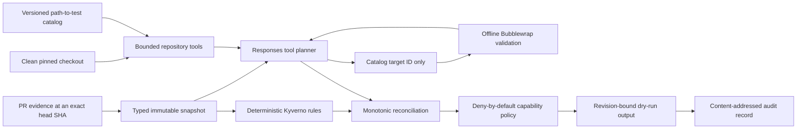

# Architecture and Trust Boundary

## The design from first principles

Routine maintenance automation has four different responsibilities:

1. observe the current pull-request revision;
2. understand what the change may affect;
3. decide what the system is allowed to do;
4. execute and record the authorized work.

Combining those responsibilities in one model prompt would make untrusted repository text, model
judgment, and maintainer authority indistinguishable. This prototype separates them.



## What is online and what is offline

The official OpenAI Python SDK sends the bounded snapshot/tool conversation through the selected
Responses-compatible transport. That model request is online. The model has no direct network
tool, filesystem handle, GitHub token, or shell.

Only the Kyverno validation process is forced offline. The model requests
`unit.cel.compiler`; the host resolves that ID to `go test ./pkg/cel/compiler` from the digested
catalog. Bubblewrap gives the process an unshared network namespace, read-only source and module
cache, fresh temporary build cache, cleared environment, dropped capabilities, and time/output/
address-space/file limits.

## Authority model

The deterministic rules establish minimum checks, risk, and escalation. Reconciliation is
monotonic:

```text
required checks = rule requirements UNION model additions
risk            = MAX(rule risk, model risk)
escalation      = rule escalation OR model uncertainty
actions         = model proposals INTERSECT trusted capability policy
```

The model cannot remove a test, lower risk, invent a capability, run arbitrary argv, read a secret,
or authorize a GitHub mutation. The current outward executor only renders a dry-run plan. Existing
CI, review, DCO, code ownership, and branch protection remain authoritative.

## Why the real PR case matters

PR #17067 changes only `go.mod` and `go.sum`, updating `cel-go` from 0.30 to 0.31. A file-count
heuristic would call that small. Kyverno-specific reasoning identifies a broad CEL runtime blast
radius, requires dependency review and the full unit gate, recommends behavioral coverage, and
executes the short CEL compiler compatibility target as immediate evidence. The result is still
escalated to a human rather than auto-merged.

## Production boundary

Bubblewrap is credible local isolation evidence, not a production multi-tenant sandbox claim. A
production job service should add disposable image/checkout provenance, cgroup and PID quotas,
seccomp policy, artifact attestation, short-lived GitHub App credentials held outside the planner,
webhook verification, concurrency control, rate limits, and an operator-owned kill switch.
